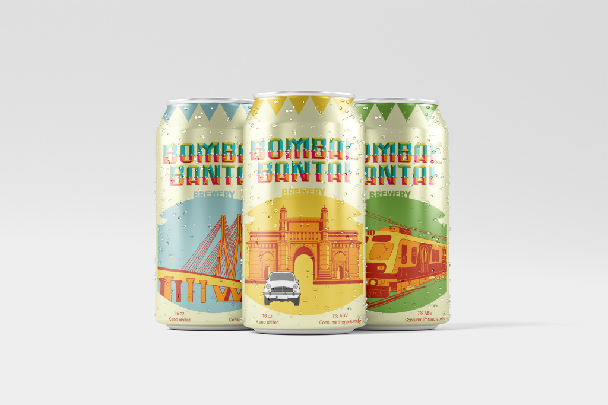
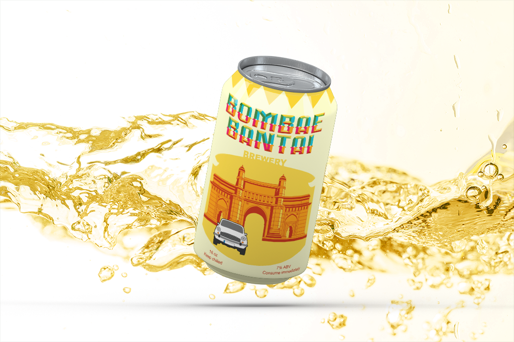
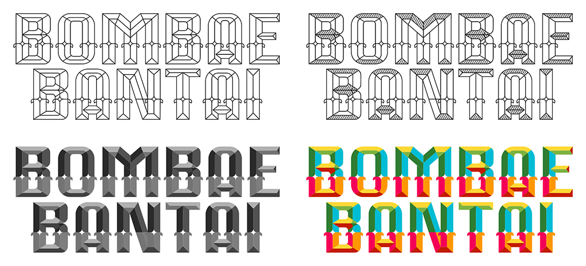
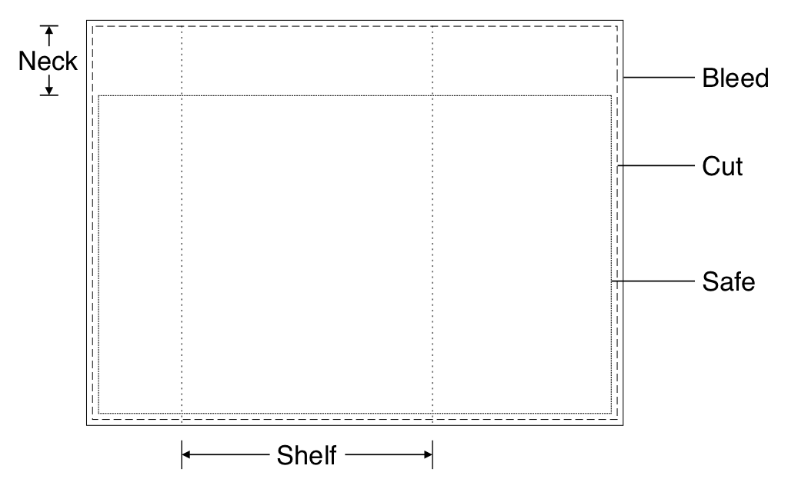

{
  "description": "An imaginary beer brand. Includes logos, can labels, boxes, posters, merchandise and yet another designing adventure.",
  "index": "2",
"resources": [{
   "title": "",
   "src": "assets/img1.png"
  }, {
    "title": "",
    "src": "assets/img2.png"
  }, {
   "title": "",
   "src": "assets/img3.png"
  }, {
   "title": "",
   "src": "assets/img4.png"
  }, {
   "title": "",
   "src": "assets/img5.png"
  }, {
   "title": "",
   "src": "assets/img6.png"
  }, {
   "title": "",
   "src": "assets/img7.png"
  }, {
    "title": "",
    "src": "assets/img8.png"
  }],
  "title": "Bombae Bantai Brewery"
}



## Introduction
{w:snap = "mt-5" w:text = "2xl"}

Bombae Bantai is my second project of the second quarter. This time, the task was a little different than before. We were asked to create a beer brand and develop its identity. For example, it was supposed to have its own name, logo, tone, styling, theme and a lot more. We had multiple objectives for this. From creating a brand story, to designing the beer can labels, boxes, posters, merchandise and so on. I had been seeing beer cans, bottles and brands around me for quite a long time now (in forms of advertisements, in stores, etc.), but had never analysed one so closely. This was the initial challenge - to design an identity for something without a lot of knowledge about it. But, I dived right in.
{class = "mt-2.5"}

## The Journey
{w:snap = "mt-5" w:text = "2xl"}

Just like before, I needed to dive deeper into this project to analyse and understand it first. I started off by reading and understanding more beer brands, their design philosophies, ideation processes and about the brand as a whole.

### Naming
{w:snap = "mt-5" w:text = "xl"}

Before naming the brand, I had to come up with a theme for the brand. Not just it was one of the objectives, but it is important for a brand to be named more like what it relates the most with. After dismissing some initial ideas, I went ahead with my home city - Mumbai (formerly known as Bombay). I decided to introduce a brand which will popularize the local flavours and tastes of Mumbai. To match the local lingo of the city, the brand was named Bombae Bantai Brewery.
{w:snap = "mt-5" w:text = "xl"}

Moving to designing the logo, I prepared a style reference guide that I wanted to follow for the entire project. Keeping that style in mind and dismissing some additional designs, here is the final logo with its variations:

### Grid
{w:snap = "mt-5" w:text = "xl"}

