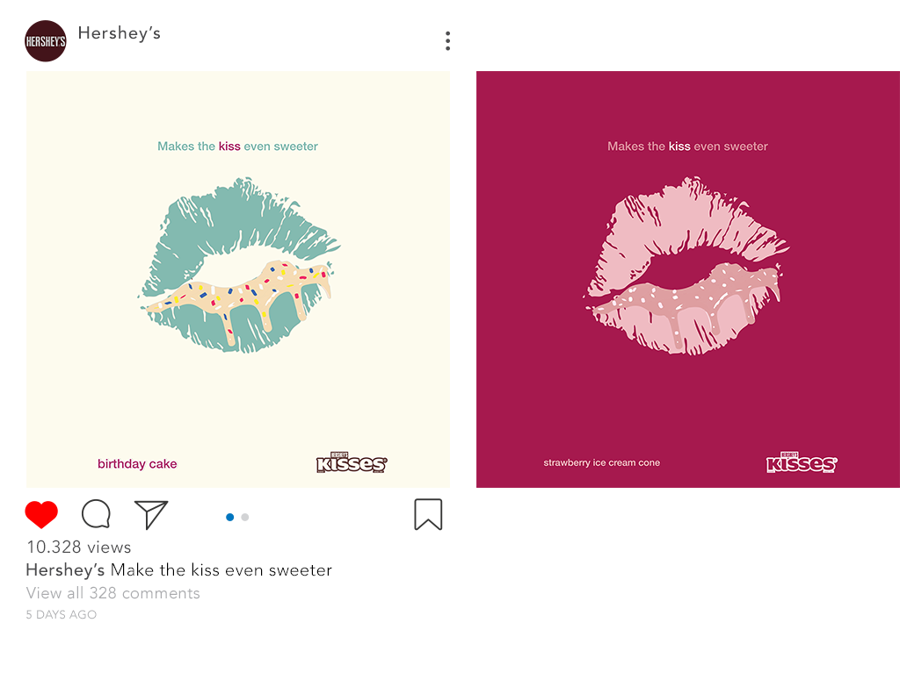

{
  "description": "Advertise four brands without using resources from the internet.",
  "index": 11,
  "resources": [{
    "src": "assets/img1.jpg",
    "title": "Allstar OOH ad"
  }, {
    "src": "assets/img2.png",
    "title": "Allstar Instagram ad 1"
  }, {
    "src": "assets/img3.png",
    "title": "Allstar Instagram ad 2"
  }, {
    "src": "assets/img4.jpg",
    "title": "Durex OOH ad"
  }, {
    "src": "assets/img5.jpg",
    "title": "Durex bus-stop ad"
  }, {
    "src": "assets/img6.gif",
    "title": "Hamilton Beach animated ad"
  }, {
    "src": "assets/img7.jpg",
    "title": "Hamilton Beach OOH ad"
  }, {
    "src": "assets/img8.png",
    "title": "Hershey's Instagram ad"
  }],
  "title": "Four Forty-Four"
}

For this project, the goal was to develop and steer the art in a direction that would help advertise a few brands. The challenge was to create everything from scratch without relying on any existing graphical resources.

## Allstar

  

    
  

  

    

      

        
        

          
          
        

      

      

        

          
          
        

      

    

  

## Durex



## Hamilton Beach



## Hershey's

