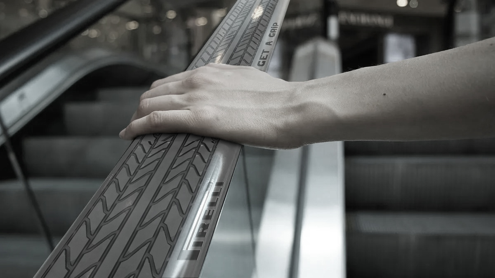
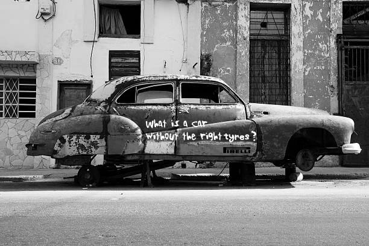

{
  "description": "A collection of ambient ads with focus on Pirelli's strong selling points.",
  "index": 8,
  "resources": [{
    "src": "assets/img1.jpg",
    "title": "Ambient ad on broken car"
  }, {
    "src": "assets/img2.jpg",
    "title": "Ambient ad on escalator railing"
  }],
  "title": "Pirelli"
}

Pirelli is a tyre manufacturing company. The project was to create two ambient ads featuring the unique selling proposition of the brand. Pirelli has always focused and advertised its superior grip as compared to other brands. A lot of high-value brands prefer Pirelli for this reason. The ambient ads are created to highlight the brand in a unique way.

