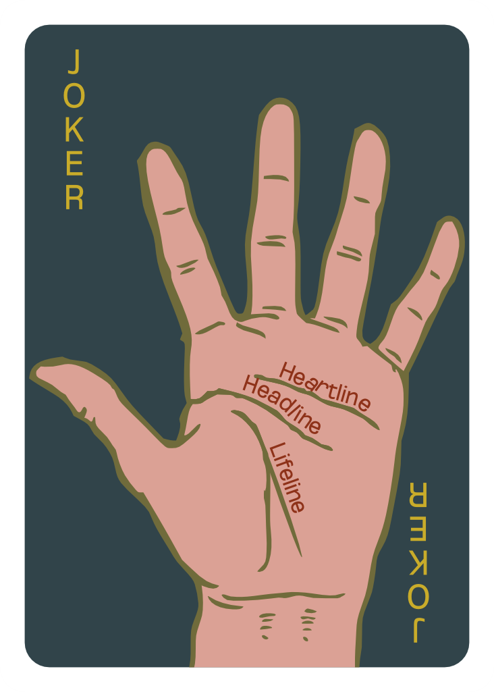

{
  "description": "A card deck designed from scratch, with typography at its core. And why is it named Zoddlini? Read more to find out.",
  "index": "1",
  "resources": [{
    "title": "a",
    "src": "assets/img1.png"
  }, {
    "title": "a",
    "src": "assets/img2.png"
  }, {
    "title": "a",
    "src": "assets/img3.png"
  }, {
    "title": "a",
    "src": "assets/img4.png"
  }, {
    "title": "a",
    "src": "assets/img5.png"
  }, {
    "title": "a",
    "src": "assets/img6.png"
  }, {
    "title": "a",
    "src": "assets/img7.png"
  }, {
    "title": "a",
    "src": "assets/img8.png"
  }, {
    "title": "a",
    "src": "assets/img9.png"
  }, {
    "title": "a",
    "src": "assets/img10.png"
  }, {
    "title": "a",
    "src": "assets/img11.png"
  }, {
    "title": "a",
    "src": "assets/img12.png"
  }, {
    "title": "a",
    "src": "assets/img13.png"
  }, {
    "title": "",
    "src": "assets/img14.png"
  }, {
    "title": "",
    "src": "assets/img15.png"
  }, {
    "title": "",
    "src": "assets/img16.png"
  }, {
    "title": "",
    "src": "assets/img17.png"
  }, {
    "title": "",
    "src": "assets/img18.png"
  }, {
    "title": "",
    "src": "assets/img19.png"
  }, {
    "title": "",
    "src": "assets/img20.png"
  }, {
    "title": "",
    "src": "assets/img21.png"
  }, {
    "title": "",
    "src": "assets/img22.png"
  }, {
    "title": "",
    "src": "assets/img23.png"
  }, {
    "title": "",
    "src": "assets/img24.png"
  }, {
    "title": "",
    "src": "assets/img25.png"
  }, {
    "title": "",
    "src": "assets/img26.png"
  }, {
    "title": "",
    "src": "assets/img27.png"
  }, {
    "title": "",
    "src": "assets/img28.png"
  }, {
    "title": "",
    "src": "assets/img29.png"
  }, {
    "title": "",
    "src": "assets/img30.png"
  }, {
"title": "",
"src": "assets/img31.png"
}, {
"title": "",
"src": "assets/img32.png"
}, {
"title": "",
"src": "assets/img33.png"
}, {
"title": "",
"src": "assets/img34.png"
}, {
"title": "",
"src": "assets/img35.png"
}, {
"title": "",
"src": "assets/img36.png"
}, {
"title": "",
"src": "assets/img37.png"
}, {
"title": "",
"src": "assets/img38.png"
}, {
"title": "",
"src": "assets/img39.png"
}, {
"title": "",
"src": "assets/img40.png"
}, {
"title": "",
"src": "assets/img41.png"
}, {
"title": "",
"src": "assets/img42.png"
}, {
"title": "",
"src": "assets/img43.png"
}, {
"title": "",
"src": "assets/img44.png"
}, {
"title": "",
"src": "assets/img45.png"
}, {
"title": "",
"src": "assets/img46.png"
}, {
"title": "",
"src": "assets/img47.png"
}, {
"title": "",
"src": "assets/img48.png"
}, {
"title": "",
"src": "assets/img49.png"
}, {
"title": "",
"src": "assets/img50.png"
}, {
"title": "",
"src": "assets/img51.png"
}, {
"title": "",
"src": "assets/img52.png"
}, {
"title": "",
"src": "assets/img53.png"
}, {
"title": "",
"src": "assets/img54.png"
}, {
"title": "",
"src": "assets/img55.png"
}, {
"title": "",
"src": "assets/img56.png"
}, {
"title": "",
"src": "assets/img57.png"
}, {
"title": "",
"src": "assets/img58.png"
}, {
"title": "",
"src": "assets/img59.png"
}, {
"title": "",
"src": "assets/img60.png"
}, {
"title": "",
"src": "assets/img61.png"
}, {
"title": "",
"src": "assets/img62.png"
}],
  "title": "Zoddlini"
}

## Introduction
{w:snap = "mt-5" w:text = "2xl"}

Zoddlini is a project I worked on in Quarter 2 of my Masters programme. We were assigned a task to choose and promote any typeface in the form of a card deck. We had the freedom of choice in terms of the theme, colour palettes, and even the typeface that we were going to choose. But, a large part of this project depended on some heavy use of creativity. Coming up with design ideas for each card of a deck + 2 jokers + 1 back cover was easier said than done. We had to promote various aspects of the typeface like kerning, leading, tracking, while also adding design elements to the cards. This seemed tough, very tough and I was worried about the possibility of completion of this project. Nevertheless, I began with the project, as we only had a month in hand.
{w:m = "t-2.5"}

## The Task
{w:m = "t-5" w:snap = "mt-5" w:text = "2xl"}

The task in hand was clear, though not quite easy. We've all been seeing the standard deck of playing cards since a long time now. Now, I had to re-imagine the deck from scratch, completely removing the original cards from mind. After taking time to read, understand and analyse the entire project, I began my research. At first, I selected a typeface as that's what the entire project was mainly about - to teach us the importance and usage of typeface in advertising. Then, I started with selecting multiple topics on which I would have liked to work. I shortlisted _Feminism_, _Food of India_ and _Zodiac Signs_. After further thinking, I realised that, Zodiac was going to be my best bet. But, even then there were a lot of questions that needed my attention.
{w:m = "t-2.5"}

## The Journey
{w:m = "t-5" w:snap = "mt-5" w:text = "2xl"}

I started on with some research. I had the example projects of my senior to refer to. I checked those out, started exploring the internet for more such content and ideas and started sketching some ideas of myself.
{w:m = "t-2.5"}

### Typeface
{w:m = "t-5" w:snap = "mt-5" w:text = "xl"}

Typeface was probably one of the most important choices of this project. After all, the project was mainly about using typography effectively. I anticipated that I'd probably require a font with a significant number of variations. At the same time, it should match the theme, and be pleasant to look at. After some exploring, I landed on [Oddlini](https://www.fontspring.com/fonts/sugargliderz/oddlini/). It seems to be like a graceful font with about 360 variations!
{w:m = "t-2.5"}

> As a side note, this is exactly how I named the project. Zodiac + Oddlini = Zoddlini.
{w:bg = "white/25" w:border = "l-2" w:m = "t-2.5" w:p = "l-2.5 y-1"}

### Suit Divisions
{w:m = "t-5" w:snap = "mt-5" w:text = "xl"}

I tried to put some efforts in determining how to divide the suits. Yes, they were supposed to be the typical _clubs_, _diamonds_, _hearts_ and _spades_. But, according to the task at hand, I was supposed to create a new deck, which included me having to assign new sections to each of this suit. Thankfully, this was an easy task as Zodiac itself has divided the signs into 4 types, _earth_, _fire_, _water_ and _air_ signs. I simply assigned each of them to a suit.
{w:m = "t-2.5"}

### Suit Symbols
{w:m = "t-5" w:snap = "mt-5" w:text = "xl"}

Moving further in the project, the next step was to make new symbols for the suits. I went with a geometric and sharp look for the symbols instead of the curved ones that we're used to see. To me, this appeared to be like a change from the usual. The colour for each suit has been picked from the [colour palette discussed below](#colour-palette).
{w:m = "t-2.5"}

### Colour Palette
{w:m = "t-5" w:snap = "mt-5" w:text = "xl"}

Before I actually decided my colour palette, I had to make a moodboard. Not only this was one of the tasks in the list, but it also helped me visualise the theme I wanted to set for my designs. After heavy sourcing the internet, here's what I made:
{w:m = "t-2.5"}

From this, I decided to make a different colour palette for each deck. I tried to pick the closest colour to the actual colour of the element.
{w:m = "t-2.5"}

  
  
  
  

### Grid
{w:m = "t-5" w:snap = "mt-5" w:text = "xl"}

The last stage before starting to work on cards was to prepare a grid. It helped me maintain consistency till the end. I marked my safe-areas and set dimensions that I was going to use.
{w:m = "t-2.5"}

### Next steps
{w:m = "t-5" w:snap = "mt-5" w:text = "xl"}

After this, it was mainly the same pattern for each card. Ideate, sketch, trace in the application, refine, add colours and finalise. Sounds easy to list it this way, but was a lot harder than that. Here's how a typical day in CoreDRAW looked like during the duration of this project:
{w:m = "t-2.5"}

## End Result
{w:m = "t-5" w:snap = "mt-5" w:text = "2xl"}

The end result was an outcome of over a month long effort of thinking, attempting, failing and retrying to create the best deck I could come up with. As said before, it's quite similar to a normal card deck in terms of card distribution. All these suits consist of a common pattern - they have specific number assigned for specific type of cards. Here are the 4 suits:
{w:m = "t-2.5"}

### Clubs
{w:m = "t-5" w:snap = "mt-5" w:text = "xl"}

The suit of clubs consists of the _earth_ signs: Capricorn, Taurus, Virgo. Earth signs are known to be stable, pragmatic, and unwavering. Sensual to the core, they love to collect material objects - especially when they're treating themselves as a reward for all their hard work. From the chosen colour scheme, the shades of yellow/green were the best match for this suit.
{w:m = "t-2.5"}



### Diamonds
{w:m = "t-5" w:snap = "mt-5" w:text = "xl"}

The suit of clubs consists of the _fire_ signs: Aries, Leo, Sagittarius. Fire signs are known for their passion, creativity, spontaneity, inspiration, and competitive spirit. Overall, the people with these Zodiac signs desperately need to be inspired to be happy. From the chosen colour scheme, the shades of red were the best match for this suit.
{w:m = "t-2.5"}



### Hearts
{w:m = "t-5" w:snap = "mt-5" w:text = "xl"}

The suit of clubs consists of the _water_ signs: Cancer, Pisces, Scorpio. Highly imaginative, water signs are predisposed to creativity, vivid dreams and acute insights. Water signs _feel_ their way through the world, relying on instinct and emotion to guide them. From the chosen colour scheme, the shades of blue were the best match for this suit.
{w:m = "t-2.5"}



### Spades
{w:m = "t-5" w:snap = "mt-5" w:text = "xl"}

The suit of clubs consists of the _air_ signs: Aquarius, Gemini, Libra. They analyze, synthesize, and probe. They breeze through life, never stopping to catch their breath. They have a _live and let live_ mentality, and their intelligence helps them make decisions easily. While air is considered colourless, the only available colour scheme was the shades of pink, so I decided to go ahead with that one.
{w:m = "t-2.5"}



### Extras
{w:m = "t-5" w:snap = "mt-5" w:text = "xl"}

Extras consist of the few extra cards that I had to make, which are 2 Jokers and a Back face that is common for all cards. The Jokers use the concept of Zodiac on palms. It shows where each Zodiac sign is considered to be located on the hand and also shows the meaning of some important lines on the hand. The back cover is an abstract design that matches the theme and also depicts the sun.
{w:m = "t-2.5"}

